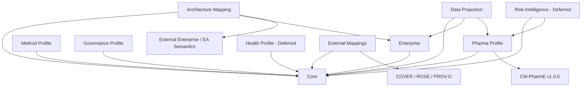

# SemRisk G2 Dependency Diagram

## Direction rule
Arrows mean `depends on / references`. No profile, external owner, database or application is allowed to define Core identity.

## Paper-1 active path
`Core → Enterprise/Architecture support → Pharma bounded profile → later DataProjection/evaluation`.

Health and RiskIntelligence are explicit deferred branches.