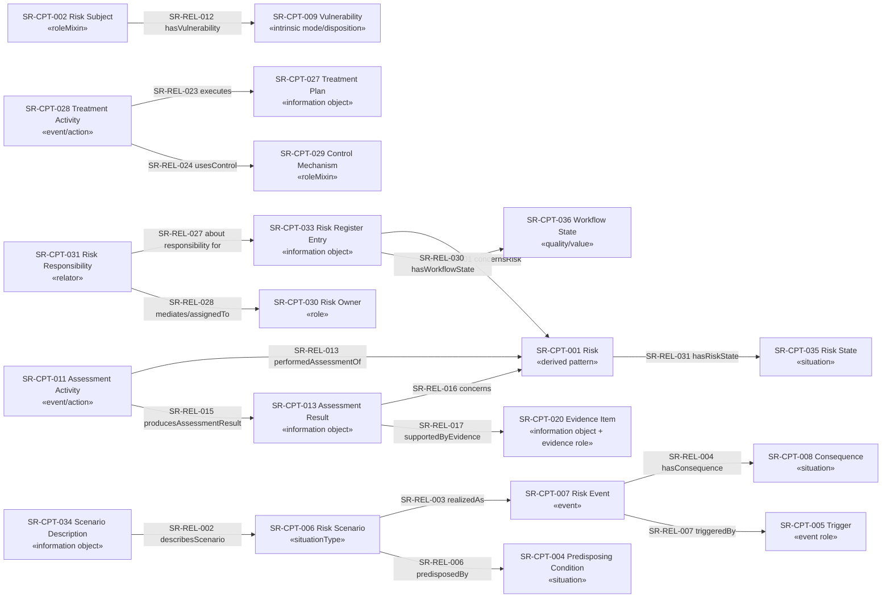

# SemRisk Paper-1 Foundational Conceptual Model v0.1

**Source of truth:** `foundational-category-registry-v0.1.csv` and `foundational-relation-rationale-v0.1.csv`.  
This diagram is a projection; it introduces no new semantic IDs.

## Foundational invariants
1. Information artifacts are not real-world events/situations.
2. Assessment Activity is an event; Assessment Result is an information object.
3. Vulnerability is an intrinsic disposition; Predisposing Condition is a situation.
4. Risk Owner is a role; Risk Responsibility is the assignment relator/context.
5. Risk State is a situation; Workflow State is an information/workflow quality.
6. Core Trigger is event-role semantics; threshold triggers stay Method/Application.
7. Risk remains a derived domain pattern rather than being forced into COVER's Quality model or a single UFO primitive.
