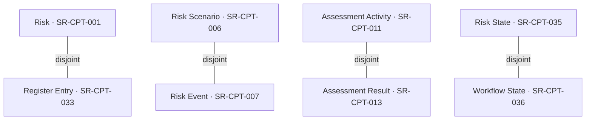

# Paper 1 Figure 1 candidate — selected explicit distinctions (v0.1)

**Status:** editable source candidate for #33; not final IEEE export or a completeness claim.  
**Claim binding:** SR-CL01, supported only for the selected, formally checked Paper-1 pattern.  
**Exact source:** Core blob `cf20fe78687a4db4dcffc21e75297f6801cc5cb4`; Enterprise blob `b3c559b520442423a175db72e32f8fd7384d02cb`, P1-R2 `0.1.0-rc.1`. See [formal reference](../../docs/ontology/formal-ontology-description-p1-r2-v0.2.md), FD-C–G and [source entity inventory](../../docs/ontology/p1-r2-formal-source-entity-reference-v0.1.csv). Final publication binding awaits #55.

**Caption candidate.** Four selected explicit OWL disjointness commitments in the inspected Core and Enterprise modules. The diagram displays selected class pairs only; it does not depict every class, all constraints, asserted relations, imported axioms, or a validated domain-wide semantic model.

| Pair | Source assertion | Manuscript interpretation |
| --- | --- | --- |
| SR-CPT-001 / SR-CPT-033 | Core Risk versus Enterprise Risk Register Entry | Managed phenomenon versus its information record. |
| SR-CPT-006 / SR-CPT-007 | Core Scenario versus Event | Possible pattern versus realized occurrence. |
| SR-CPT-011 / SR-CPT-013 | Core Assessment Activity versus Result | Activity versus contextual outcome. |
| SR-CPT-035 / SR-CPT-036 | Core Risk State versus Enterprise Workflow State | Modeled risk situation versus record workflow snapshot. |

**Vector export:** [90 × 70 mm SVG](paper1-core-distinction-figure-v0.1.svg), generated by `python3 tools/build_paper1_core_distinction_svg.py`. The generator fails if any of the four selected `owl:disjointWith` assertions or class labels disappears from the exact Core/Enterprise Turtle files. The SVG was rendered and visually checked at 1350 px width; the final venue template placement and #55 release binding remain pending.

**Pre-export controls:** confirm both blobs still match release candidate, check the exact `owl:disjointWith` triples and selected IDs, render at one-column width with legible labels, add numbered caption and SR-CL01 citation/claim anchor, and reconcile against #53/#55. No visual inference from vertical placement or edge direction is intended.
