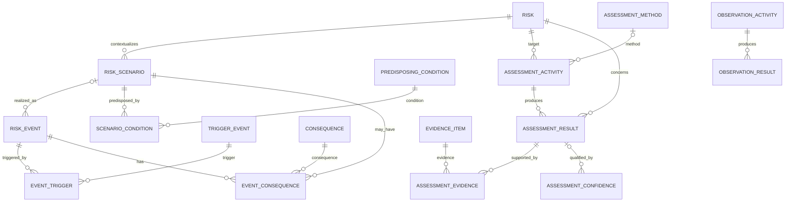

# Core + Assessment subject-area ERD v0.1

```mermaid
erDiagram
  RISK ||--o{ RISK_SCENARIO : contextualizes
  RISK_SCENARIO o|--o{ RISK_EVENT : realized_as
  RISK_SCENARIO ||--o{ SCENARIO_CONDITION : predisposed_by
  PREDISPOSING_CONDITION ||--o{ SCENARIO_CONDITION : condition
  RISK_EVENT ||--o{ EVENT_TRIGGER : triggered_by
  TRIGGER_EVENT ||--o{ EVENT_TRIGGER : trigger
  RISK_EVENT ||--o{ EVENT_CONSEQUENCE : has
  RISK_SCENARIO ||--o{ EVENT_CONSEQUENCE : may_have
  CONSEQUENCE ||--o{ EVENT_CONSEQUENCE : consequence

  RISK ||--o{ ASSESSMENT_ACTIVITY : target
  ASSESSMENT_METHOD o|--o{ ASSESSMENT_ACTIVITY : method
  ASSESSMENT_ACTIVITY ||--o{ ASSESSMENT_RESULT : produces
  RISK ||--o{ ASSESSMENT_RESULT : concerns
  ASSESSMENT_RESULT ||--o{ ASSESSMENT_EVIDENCE : supported_by
  EVIDENCE_ITEM ||--o{ ASSESSMENT_EVIDENCE : evidence
  ASSESSMENT_RESULT o|--o{ ASSESSMENT_CONFIDENCE : qualified_by
  OBSERVATION_ACTIVITY ||--o{ OBSERVATION_RESULT : produces
```
