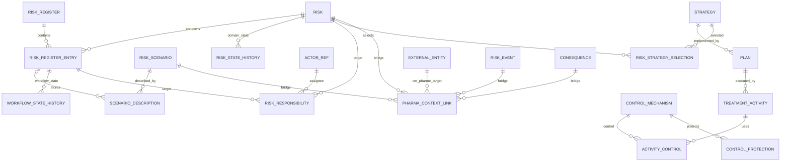

# Enterprise + Treatment + Pharma subject-area ERD v0.1

```mermaid
erDiagram
  RISK_REGISTER ||--o{ RISK_REGISTER_ENTRY : contains
  RISK ||--o{ RISK_REGISTER_ENTRY : concerns
  RISK_SCENARIO ||--o{ SCENARIO_DESCRIPTION : described_by
  RISK_REGISTER_ENTRY o|--o{ SCENARIO_DESCRIPTION : stores

  RISK ||--o{ RISK_STATE_HISTORY : domain_state
  RISK_REGISTER_ENTRY ||--o{ WORKFLOW_STATE_HISTORY : workflow_state

  ACTOR_REF ||--o{ RISK_RESPONSIBILITY : assignee
  RISK ||--o{ RISK_RESPONSIBILITY : target
  RISK_REGISTER_ENTRY ||--o{ RISK_RESPONSIBILITY : target

  STRATEGY ||--o{ PLAN : implemented_by
  PLAN ||--o{ TREATMENT_ACTIVITY : executed_by
  TREATMENT_ACTIVITY ||--o{ ACTIVITY_CONTROL : uses
  CONTROL_MECHANISM ||--o{ ACTIVITY_CONTROL : control
  CONTROL_MECHANISM ||--o{ CONTROL_PROTECTION : protects

  RISK ||--o{ RISK_STRATEGY_SELECTION : selects
  STRATEGY ||--o{ RISK_STRATEGY_SELECTION : selected

  EXTERNAL_ENTITY ||--o{ PHARMA_CONTEXT_LINK : cm_pharme_target
  RISK ||--o{ PHARMA_CONTEXT_LINK : bridge
  RISK_SCENARIO ||--o{ PHARMA_CONTEXT_LINK : bridge
  RISK_EVENT ||--o{ PHARMA_CONTEXT_LINK : bridge
  CONSEQUENCE ||--o{ PHARMA_CONTEXT_LINK : bridge
```
