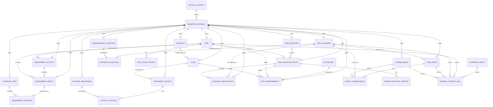

# SemRisk relational Master ERD v0.1

```mermaid
erDiagram
  SOURCE_ARTIFACT ||--o{ SEMANTIC_INSTANCE : sources
  SEMANTIC_INSTANCE ||--o| RISK : types
  SEMANTIC_INSTANCE ||--o| RISK_SCENARIO : types
  SEMANTIC_INSTANCE ||--o| RISK_EVENT : types
  SEMANTIC_INSTANCE ||--o| CONSEQUENCE : types
  SEMANTIC_INSTANCE ||--o| PREDISPOSING_CONDITION : types
  SEMANTIC_INSTANCE ||--o| ASSESSMENT_ACTIVITY : types
  SEMANTIC_INSTANCE ||--o| ASSESSMENT_RESULT : types
  SEMANTIC_INSTANCE ||--o| EVIDENCE_ITEM : types
  SEMANTIC_INSTANCE ||--o| STRATEGY : types
  SEMANTIC_INSTANCE ||--o| PLAN : types
  SEMANTIC_INSTANCE ||--o| TREATMENT_ACTIVITY : types
  SEMANTIC_INSTANCE ||--o| CONTROL_MECHANISM : types
  SEMANTIC_INSTANCE ||--o| RISK_REGISTER : types
  SEMANTIC_INSTANCE ||--o| RISK_REGISTER_ENTRY : types
  SEMANTIC_INSTANCE ||--o| SCENARIO_DESCRIPTION : types
  SEMANTIC_INSTANCE ||--o| RISK_RESPONSIBILITY : types

  RISK_SCENARIO o|--o{ RISK_EVENT : realized_as
  RISK_EVENT ||--o{ EVENT_CONSEQUENCE : has
  RISK_SCENARIO ||--o{ EVENT_CONSEQUENCE : may_have
  CONSEQUENCE ||--o{ EVENT_CONSEQUENCE : target

  RISK_SCENARIO ||--o{ SCENARIO_CONDITION : predisposed_by
  PREDISPOSING_CONDITION ||--o{ SCENARIO_CONDITION : participates

  RISK ||--o{ ASSESSMENT_ACTIVITY : assessed_by
  ASSESSMENT_ACTIVITY ||--o{ ASSESSMENT_RESULT : produces
  RISK ||--o{ ASSESSMENT_RESULT : concerns
  ASSESSMENT_RESULT ||--o{ ASSESSMENT_EVIDENCE : supported_by
  EVIDENCE_ITEM ||--o{ ASSESSMENT_EVIDENCE : supports

  STRATEGY o|--o{ PLAN : implemented_by
  PLAN o|--o{ TREATMENT_ACTIVITY : executed_by
  TREATMENT_ACTIVITY ||--o{ ACTIVITY_CONTROL : uses
  CONTROL_MECHANISM ||--o{ ACTIVITY_CONTROL : participates

  RISK_REGISTER ||--o{ RISK_REGISTER_ENTRY : contains
  RISK ||--o{ RISK_REGISTER_ENTRY : concerns
  RISK_SCENARIO ||--o{ SCENARIO_DESCRIPTION : described_by
  RISK_REGISTER_ENTRY o|--o{ SCENARIO_DESCRIPTION : records

  RISK ||--o{ RISK_STATE_HISTORY : has
  RISK_REGISTER_ENTRY ||--o{ WORKFLOW_STATE_HISTORY : has

  ACTOR_REF ||--o{ RISK_RESPONSIBILITY : assigned_to
  RISK ||--o{ RISK_RESPONSIBILITY : target
  RISK_REGISTER_ENTRY ||--o{ RISK_RESPONSIBILITY : target
  PLAN ||--o{ RISK_RESPONSIBILITY : target

  EXTERNAL_ENTITY ||--o{ PHARMA_CONTEXT_LINK : target
  RISK ||--o{ PHARMA_CONTEXT_LINK : context
  RISK_SCENARIO ||--o{ PHARMA_CONTEXT_LINK : context
  RISK_EVENT ||--o{ PHARMA_CONTEXT_LINK : context
  CONSEQUENCE ||--o{ PHARMA_CONTEXT_LINK : context
```

The ERD is a projection of the CSV design registries; it is not a semantic source of truth.
